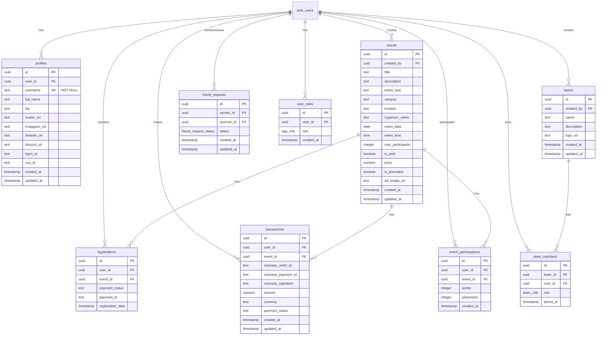

# Skill Fusion - Complete Technical Documentation

**Live URL:** [https://skill-fusion-hub.lovable.app](https://skill-fusion-hub.lovable.app)

**Project Type:** University Major Internal Evaluation Project

---

## 📋 Table of Contents

1. [Project Overview](#project-overview)
2. [Full Tech Stack](#full-tech-stack)
3. [File & Folder Structure](#file--folder-structure)
4. [Major Features](#major-features)
5. [Security System](#security-system)
6. [Database Schema](#database-schema)
7. [API Documentation](#api-documentation)
8. [Deployment Details](#deployment-details)
9. [Getting Started](#getting-started)
10. [Team & Credits](#team--credits)
11. [Final Summary](#final-summary)

---

## 🎯 Project Overview

**Skill Fusion** is a comprehensive event management platform designed for campus and public events. It enables students and organizations to create, manage, and participate in gaming and skill-based events with features including:

- **Event Management**: Create and manage campus-based and public events
- **User Profiles**: Customizable profiles with social media links and gaming IDs
- **Leaderboard System**: Ranking based on event participation and points
- **Teams**: Form teams, invite friends, and participate together
- **Payment Integration**: Razorpay integration for paid events
- **Friends System**: Connect with other users, send friend requests
- **Real-time Updates**: Live notifications for registrations and requests

**Purpose**: Built as a major project for university internal evaluation, demonstrating full-stack development capabilities with modern web technologies.

---

## 🛠 Full Tech Stack

### Frontend Technologies

| Technology | Version | Purpose |
|------------|---------|---------|
| **React** | 18.3.1 | UI library for building component-based interfaces |
| **TypeScript** | Latest | Type-safe JavaScript for better code quality |
| **Vite** | Latest | Fast build tool and development server |
| **Tailwind CSS** | Latest | Utility-first CSS framework |
| **ShadCN UI** | Latest | Accessible and customizable component library |
| **React Router DOM** | 6.30.1 | Client-side routing |
| **React Hook Form** | 7.61.1 | Form state management and validation |
| **Zod** | 3.25.76 | Schema validation library |
| **Lucide React** | 0.462.0 | Icon library |
| **Sonner** | 1.7.4 | Toast notifications |
| **date-fns** | 3.6.0 | Date manipulation library |

### Backend Technologies

| Technology | Purpose |
|------------|---------|
| **Supabase** | Backend-as-a-Service (Database, Auth, Storage, Edge Functions) |
| **PostgreSQL** | Relational database (via Supabase) |
| **Edge Functions** | Serverless functions for backend logic |
| **Deno Runtime** | Runtime for edge functions |

### Authentication & Authorization

- **Supabase Auth**: JWT-based authentication
- **Email/Password Login**: Standard authentication flow
- **Row Level Security (RLS)**: Database-level access control
- **User Roles System**: Admin/User role management with security definer functions

### Payment Integration

- **Razorpay**: Payment gateway for paid events
- **Signature Verification**: Server-side payment validation
- **Order Management**: Complete payment lifecycle handling

### Storage

- **Supabase Storage**: Object storage for files
  - `avatars` bucket: User profile pictures (public read, authenticated write)
  - `event-ads` bucket: Event advertisement images (public read, authenticated write)

### State Management

- **React Context**: Global state for authentication
- **React Hooks**: Local component state management
- **useEffect/useState**: Standard React patterns

---

## 📁 File & Folder Structure

```
skill-fusion/
├── public/
│   ├── robots.txt              # SEO robots configuration
│   └── favicon.ico             # Site favicon
│
├── src/
│   ├── assets/                 # Static assets
│   │   ├── brand-logo.png      # Brand logo
│   │   └── hero-gaming.jpg     # Hero section image
│   │
│   ├── components/             # Reusable React components
│   │   ├── ui/                 # ShadCN UI components
│   │   │   ├── button.tsx
│   │   │   ├── card.tsx
│   │   │   ├── dialog.tsx
│   │   │   ├── input.tsx
│   │   │   ├── select.tsx
│   │   │   ├── tabs.tsx
│   │   │   ├── toast.tsx
│   │   │   └── ... (30+ UI components)
│   │   │
│   │   ├── EventCard.tsx       # Event display card component
│   │   ├── Footer.tsx          # Global footer with team credits
│   │   ├── Navbar.tsx          # Navigation bar component
│   │   ├── PromotedEventsCarousel.tsx  # Homepage carousel
│   │   └── UsernamePrompt.tsx  # Username setup dialog
│   │
│   ├── hooks/                  # Custom React hooks
│   │   ├── use-mobile.tsx      # Mobile detection hook
│   │   └── use-toast.ts        # Toast notification hook
│   │
│   ├── integrations/           # Third-party integrations
│   │   └── supabase/
│   │       ├── client.ts       # Supabase client configuration
│   │       └── types.ts        # Auto-generated TypeScript types
│   │
│   ├── lib/
│   │   └── utils.ts            # Utility functions (cn, etc.)
│   │
│   ├── pages/                  # Application pages/routes
│   │   ├── Index.tsx           # Homepage with promoted events
│   │   ├── Events.tsx          # Events listing with filters
│   │   ├── EventDetail.tsx     # Single event details & registration
│   │   ├── CreateEvent.tsx     # Event creation form
│   │   ├── Profile.tsx         # User profile page
│   │   ├── Leaderboard.tsx     # Rankings display
│   │   ├── Friends.tsx         # Friends management
│   │   ├── Teams.tsx           # Teams management
│   │   ├── Auth.tsx            # Login/Signup page
│   │   ├── Admin.tsx           # Admin dashboard
│   │   └── NotFound.tsx        # 404 error page
│   │
│   ├── scripts/
│   │   └── seedEvents.ts       # Database seeding script
│   │
│   ├── App.tsx                 # Root application component
│   ├── main.tsx                # Application entry point
│   └── index.css               # Global styles & design tokens
│
├── supabase/
│   ├── config.toml             # Supabase project configuration
│   ├── functions/              # Edge functions (serverless)
│   │   ├── create-razorpay-order/
│   │   │   └── index.ts        # Payment order creation
│   │   └── verify-razorpay-payment/
│   │       └── index.ts        # Payment verification
│   └── migrations/             # Database migration files
│
├── .env                        # Environment variables (auto-generated)
├── package.json                # Dependencies
├── tailwind.config.ts          # Tailwind CSS configuration
├── tsconfig.json               # TypeScript configuration
└── vite.config.ts              # Vite build configuration
```

### Key Directory Purposes

- **`/src/components/ui/`**: Pre-built, accessible UI components from ShadCN
- **`/src/pages/`**: Route-level components (each page in the app)
- **`/src/integrations/supabase/`**: Auto-generated Supabase configuration
- **`/supabase/functions/`**: Backend serverless functions
- **`/supabase/migrations/`**: Database version control

---

## ✨ Major Features

### 1. Authentication System

**Signup Flow:**
- Email/password registration
- Unique username requirement (enforced at database level)
- Automatic profile creation via database trigger
- Auto-confirmation enabled for development

**Login Flow:**
- Email/password authentication
- JWT token-based session management
- Persistent sessions via localStorage
- Auto-redirect on successful login

**Username System:**
- Username uniqueness validation
- Non-null constraint on username field
- Username prompt dialog on first login
- Username-based user search

**Implementation Files:**
- `src/pages/Auth.tsx` - Login/signup UI
- `src/components/UsernamePrompt.tsx` - Username setup
- Database: `profiles` table with unique username constraint

---

### 2. User Profile System

**Profile Features:**
- Avatar upload to Supabase Storage (`avatars` bucket)
- Bio and full name
- Social media links (Instagram, LinkedIn, Discord)
- Gaming IDs (BGMI, COC)
- Stats display (events registered, participated, points)
- Event participation history

**Profile Visibility:**
- Public profiles viewable by all users
- Users can only edit their own profile
- Profile photos displayed on leaderboard

**Implementation:**
```typescript
// Profile data structure
interface Profile {
  id: uuid
  user_id: uuid (references auth.users)
  username: string (unique, not null)
  full_name: string
  bio: text
  avatar_url: text
  instagram_url: text
  linkedin_url: text
  discord_url: text
  bgmi_id: text
  coc_id: text
  created_at: timestamp
  updated_at: timestamp
}
```

---

### 3. Event Management System

**Event Creation:**
- Title, description, location, organizer
- Event type and campus selection
- Date and time scheduling
- Max participants limit
- Advertisement image upload
- Paid/Free event toggle
- Event promotion option

**Event Registration:**
- Free event: Direct registration
- Paid event: Razorpay payment flow
- Registration tracking in database
- Duplicate registration prevention

**Event Discovery:**
- Search by title
- Filter by category (Gaming, Sports, Cultural, etc.)
- Filter by campus (Dehradun, Roorkee, Haldwani, etc.)
- Promoted events carousel on homepage

**Sample Data:**
- 2026 sample events seeded via `src/scripts/seedEvents.ts`
- Covers multiple event types and campuses

**Implementation Files:**
- `src/pages/CreateEvent.tsx` - Event creation form
- `src/pages/Events.tsx` - Event listing with filters
- `src/pages/EventDetail.tsx` - Event details & registration
- `src/components/EventCard.tsx` - Event card component

---

### 4. Friends System

**Friend Request Flow:**
1. Search for users by username
2. Send friend request
3. Receiver accepts/rejects request
4. Connection established on acceptance

**Features:**
- Send friend requests
- Accept/reject incoming requests
- Cancel sent requests
- Delete friend requests (both sender and receiver)
- View friends list
- View pending requests (sent and received)

**Database Schema:**
```sql
friend_requests table:
- id (uuid, primary key)
- sender_id (uuid, references auth.users)
- receiver_id (uuid, references auth.users)
- status (enum: pending, accepted, rejected)
- created_at, updated_at
```

**Security:**
- Users can only send requests as themselves
- Users can only update requests they received
- Input sanitization on username search

**Implementation:**
- `src/pages/Friends.tsx` - Complete friends management UI

---

### 5. Teams System

**Team Creation:**
- Team name and description
- Logo upload to storage
- Automatic leader assignment to creator

**Team Management:**
- Add members (must be friends)
- Remove members (leader only)
- View team roster with roles
- Team visibility (public viewing)

**Team Roles:**
- Leader: Full control, can add/remove members
- Member: Regular team participant

**Database Schema:**
```sql
teams table:
- id, name, description, logo_url
- created_by (references auth.users)
- created_at, updated_at

team_members table:
- id, team_id, user_id
- role (enum: leader, member)
- joined_at
```

**Implementation:**
- `src/pages/Teams.tsx` - Teams interface

---

### 6. Leaderboard & Ranking

**Ranking Criteria:**
- Total points earned from events
- Number of events participated
- Number of events registered

**Display Information:**
- Rank position (with trophy icons for top 3)
- Username
- Profile photo
- Events participated count
- Events registered count
- Total points

**Data Source:**
- `user_rankings` view (database view)
- Combines data from profiles, registrations, and participations
- Real-time ranking calculation

**Implementation:**
- `src/pages/Leaderboard.tsx` - Rankings display
- Search functionality to find specific users

---

### 7. Payment System (Razorpay)

**Payment Flow:**


**Edge Functions:**

1. **`create-razorpay-order`**
   - Creates Razorpay order
   - Validates event details
   - Checks for existing registration
   - Returns order ID and Razorpay key

2. **`verify-razorpay-payment`**
   - Verifies Razorpay signature
   - Creates transaction record
   - Creates registration record
   - Returns registration details

**Security Measures:**
- Server-side signature verification
- No hardcoded credentials (environment variables)
- User authentication required
- Duplicate registration prevention
- Transaction atomicity

**Implementation Files:**
- `supabase/functions/create-razorpay-order/index.ts`
- `supabase/functions/verify-razorpay-payment/index.ts`

---

### 8. Admin Dashboard

**Admin Features:**
- Seed sample events for 2026
- Database management tools
- Event oversight

**Access Control:**
- Role-based access using `user_roles` table
- Security definer function for role checking
- Server-side validation (not client-side)

**Admin Role Assignment:**
```sql
-- Manual admin role assignment
INSERT INTO user_roles (user_id, role)
VALUES ('user-uuid', 'admin');
```

**Implementation:**
- `src/pages/Admin.tsx` - Admin dashboard

---

## 🔒 Security System

### 1. Row Level Security (RLS) Policies

**Profiles Table:**
```sql
-- Everyone can view profiles
CREATE POLICY "Profiles are viewable by everyone"
ON profiles FOR SELECT USING (true);

-- Users can only update their own profile
CREATE POLICY "Users can update their own profile"
ON profiles FOR UPDATE USING (auth.uid() = user_id);

-- Users can only insert their own profile
CREATE POLICY "Users can insert their own profile"
ON profiles FOR INSERT WITH CHECK (auth.uid() = user_id);
```

**Events Table:**
```sql
-- Everyone can view events
CREATE POLICY "Events are viewable by everyone"
ON events FOR SELECT USING (true);

-- Authenticated users can create events
CREATE POLICY "Authenticated users can create events"
ON events FOR INSERT WITH CHECK (auth.uid() = created_by);

-- Users can update/delete their own events
CREATE POLICY "Users can update their own events"
ON events FOR UPDATE USING (auth.uid() = created_by);

CREATE POLICY "Users can delete their own events"
ON events FOR DELETE USING (auth.uid() = created_by);
```

**Friend Requests Table:**
```sql
-- Users can view their own friend requests
CREATE POLICY "Users can view their own friend requests"
ON friend_requests FOR SELECT
USING (auth.uid() = sender_id OR auth.uid() = receiver_id);

-- Users can send friend requests
CREATE POLICY "Users can send friend requests"
ON friend_requests FOR INSERT WITH CHECK (auth.uid() = sender_id);

-- Users can update received friend requests
CREATE POLICY "Users can update received friend requests"
ON friend_requests FOR UPDATE USING (auth.uid() = receiver_id);

-- Users can delete their own sent pending requests
CREATE POLICY "Users can delete their own sent friend requests"
ON friend_requests FOR DELETE
USING (auth.uid() = sender_id AND status = 'pending');
```

**Teams & Team Members:**
```sql
-- Everyone can view teams and members
CREATE POLICY "Teams are viewable by everyone"
ON teams FOR SELECT USING (true);

-- Team creators can update/delete their teams
CREATE POLICY "Team creators can update their teams"
ON teams FOR UPDATE USING (auth.uid() = created_by);

-- Leaders can add/remove members
CREATE POLICY "Leaders can add regular members"
ON team_members FOR INSERT
WITH CHECK (
  role = 'member' AND
  EXISTS (
    SELECT 1 FROM team_members tm
    WHERE tm.team_id = team_members.team_id
    AND tm.user_id = auth.uid()
    AND tm.role = 'leader'
  )
);
```

**Registrations & Transactions:**
```sql
-- Users can view their own records
CREATE POLICY "Users can view their own registrations"
ON registrations FOR SELECT USING (auth.uid() = user_id);

CREATE POLICY "Users can view their own transactions"
ON transactions FOR SELECT USING (auth.uid() = user_id);

-- Event organizers can view registrations for their events
CREATE POLICY "Event organizers can view registrations"
ON registrations FOR SELECT
USING (
  EXISTS (
    SELECT 1 FROM events
    WHERE events.id = registrations.event_id
    AND events.created_by = auth.uid()
  )
);
```

### 2. Storage Bucket Security

**Avatars Bucket:**
- Public read access (anyone can view)
- Authenticated write (only logged-in users can upload)
- User can only write to their own folder
- Automatic cleanup on user deletion

**Event-Ads Bucket:**
- Public read access
- Authenticated write
- File size limit: 5MB
- Allowed types: Images only

### 3. Input Validation & Sanitization

**Zod Schema Validation:**
```typescript
// Event creation validation
const eventSchema = z.object({
  title: z.string().min(1, "Title is required").max(200),
  description: z.string().max(5000),
  event_type: z.string().min(1),
  campus: z.string().min(1),
  location: z.string().min(1),
  max_participants: z.number().min(1),
  price: z.number().min(0).optional(),
  // ... more fields
});

// Auth validation
const signUpSchema = z.object({
  email: z.string().email("Invalid email address"),
  password: z.string().min(6, "Password must be at least 6 characters"),
  fullName: z.string().min(1, "Full name is required"),
  username: z.string().min(3).max(20).regex(/^[a-zA-Z0-9_]+$/),
});
```

**SQL Injection Prevention:**
- All queries use parameterized statements
- Username search sanitized: `.trim().toLowerCase()`
- No raw SQL from user input
- Supabase client handles escaping

### 4. Authentication Security

**JWT Token Management:**
- Secure storage in localStorage
- Auto-refresh on expiration
- HTTP-only cookies (via Supabase)

**Password Security:**
- Minimum 6 characters
- Hashed by Supabase Auth (bcrypt)
- Never logged or exposed

**Session Management:**
- Persistent sessions
- Auto-refresh tokens
- Secure logout (clears all tokens)

### 5. Edge Function Security

**CORS Headers:**
```typescript
const corsHeaders = {
  'Access-Control-Allow-Origin': '*',
  'Access-Control-Allow-Headers': 'authorization, x-client-info, apikey, content-type',
};
```

**Authentication Check:**
```typescript
const authHeader = req.headers.get('Authorization');
const token = authHeader?.replace('Bearer ', '');
const { data: { user }, error: authError } = await supabase.auth.getUser(token);

if (authError || !user) {
  return new Response(
    JSON.stringify({ error: 'Unauthorized' }),
    { status: 401, headers: corsHeaders }
  );
}
```

**Payment Signature Verification:**
```typescript
const hmac = crypto.createHmac('sha256', RAZORPAY_KEY_SECRET);
hmac.update(`${razorpay_order_id}|${razorpay_payment_id}`);
const generated_signature = hmac.digest('hex');

if (generated_signature !== razorpay_signature) {
  return new Response(
    JSON.stringify({ error: 'Invalid signature' }),
    { status: 400, headers: corsHeaders }
  );
}
```

### 6. Admin Role Security

**Security Definer Function:**
```sql
CREATE OR REPLACE FUNCTION public.has_role(_user_id uuid, _role app_role)
RETURNS boolean
LANGUAGE sql
STABLE SECURITY DEFINER
SET search_path = public
AS $$
  SELECT EXISTS (
    SELECT 1 FROM public.user_roles
    WHERE user_id = _user_id AND role = _role
  )
$$;
```

**Usage in RLS:**
```sql
CREATE POLICY "Admins can view all roles"
ON user_roles FOR SELECT
USING (has_role(auth.uid(), 'admin'));
```

### 7. Data Constraints

**Non-Null Constraints:**
- `profiles.username`: NOT NULL (prevents anonymous users)
- `events.created_by`: NOT NULL (tracks ownership)
- `friend_requests.sender_id/receiver_id`: NOT NULL

**Unique Constraints:**
- `profiles.username`: UNIQUE
- `user_roles(user_id, role)`: UNIQUE (no duplicate roles)

**Check Constraints:**
- Event price >= 0
- Max participants >= 1

---

## 🗄 Database Schema

### Entity Relationship Diagram



### Detailed Table Documentation

#### 1. **profiles**

User profile information and social links.

| Column | Type | Nullable | Default | Constraints |
|--------|------|----------|---------|-------------|
| id | uuid | No | gen_random_uuid() | PRIMARY KEY |
| user_id | uuid | No | - | REFERENCES auth.users, UNIQUE |
| username | text | No | - | UNIQUE, NOT NULL |
| full_name | text | No | - | NOT NULL |
| bio | text | Yes | - | - |
| avatar_url | text | Yes | - | - |
| instagram_url | text | Yes | - | - |
| linkedin_url | text | Yes | - | - |
| discord_url | text | Yes | - | - |
| bgmi_id | text | Yes | - | - |
| coc_id | text | Yes | - | - |
| created_at | timestamp | No | now() | - |
| updated_at | timestamp | No | now() | - |

**RLS Policies:**
- SELECT: Public (everyone can view)
- INSERT: Users can insert their own profile
- UPDATE: Users can update their own profile
- DELETE: Not allowed

---

#### 2. **events**

Event information and details.

| Column | Type | Nullable | Default | Constraints |
|--------|------|----------|---------|-------------|
| id | uuid | No | gen_random_uuid() | PRIMARY KEY |
| created_by | uuid | No | - | REFERENCES auth.users |
| title | text | No | - | NOT NULL |
| description | text | Yes | - | - |
| event_type | text | No | - | NOT NULL |
| campus | text | No | - | NOT NULL |
| location | text | No | - | NOT NULL |
| organizer_name | text | No | - | NOT NULL |
| event_date | date | No | - | NOT NULL |
| event_time | time | No | - | NOT NULL |
| max_participants | integer | No | - | NOT NULL |
| is_paid | boolean | No | false | - |
| price | numeric | Yes | - | CHECK (price >= 0) |
| is_promoted | boolean | No | false | - |
| ad_image_url | text | Yes | - | - |
| max_file_size | integer | Yes | 5242880 | - |
| created_at | timestamp | No | now() | - |
| updated_at | timestamp | No | now() | - |

**RLS Policies:**
- SELECT: Public
- INSERT: Authenticated users (must be creator)
- UPDATE: Event creator only
- DELETE: Event creator only

---

#### 3. **teams**

Team information.

| Column | Type | Nullable | Default | Constraints |
|--------|------|----------|---------|-------------|
| id | uuid | No | gen_random_uuid() | PRIMARY KEY |
| created_by | uuid | No | - | REFERENCES auth.users |
| name | text | No | - | NOT NULL |
| description | text | Yes | - | - |
| logo_url | text | Yes | - | - |
| created_at | timestamp | No | now() | - |
| updated_at | timestamp | No | now() | - |

**RLS Policies:**
- SELECT: Public
- INSERT: Authenticated users (must be creator)
- UPDATE: Team creator only
- DELETE: Team creator only

---

#### 4. **team_members**

Team membership and roles.

| Column | Type | Nullable | Default | Constraints |
|--------|------|----------|---------|-------------|
| id | uuid | No | gen_random_uuid() | PRIMARY KEY |
| team_id | uuid | No | - | REFERENCES teams |
| user_id | uuid | No | - | REFERENCES auth.users |
| role | team_role | No | 'member' | ENUM: leader, member |
| joined_at | timestamp | No | now() | - |

**RLS Policies:**
- SELECT: Public
- INSERT: Team leaders can add members, creators add themselves as leader
- UPDATE: Not allowed
- DELETE: Team leaders only

---

#### 5. **friend_requests**

Friend connection requests.

| Column | Type | Nullable | Default | Constraints |
|--------|------|----------|---------|-------------|
| id | uuid | No | gen_random_uuid() | PRIMARY KEY |
| sender_id | uuid | No | - | REFERENCES auth.users |
| receiver_id | uuid | No | - | REFERENCES auth.users |
| status | friend_request_status | No | 'pending' | ENUM: pending, accepted, rejected |
| created_at | timestamp | No | now() | - |
| updated_at | timestamp | No | now() | - |

**RLS Policies:**
- SELECT: Sender or receiver
- INSERT: Authenticated users (must be sender)
- UPDATE: Receiver only
- DELETE: Sender only (pending requests)

---

#### 6. **registrations**

Event registration records.

| Column | Type | Nullable | Default | Constraints |
|--------|------|----------|---------|-------------|
| id | uuid | No | gen_random_uuid() | PRIMARY KEY |
| user_id | uuid | No | - | REFERENCES auth.users |
| event_id | uuid | No | - | REFERENCES events |
| payment_status | text | No | 'pending' | - |
| payment_id | text | Yes | - | - |
| registration_date | timestamp | No | now() | - |

**RLS Policies:**
- SELECT: User's own registrations, or event organizer
- INSERT: Authenticated users (must be registering themselves)
- UPDATE: Not allowed
- DELETE: Not allowed

---

#### 7. **transactions**

Payment transaction records.

| Column | Type | Nullable | Default | Constraints |
|--------|------|----------|---------|-------------|
| id | uuid | No | gen_random_uuid() | PRIMARY KEY |
| user_id | uuid | No | - | REFERENCES auth.users |
| event_id | uuid | No | - | REFERENCES events |
| razorpay_order_id | text | Yes | - | - |
| razorpay_payment_id | text | Yes | - | - |
| razorpay_signature | text | Yes | - | - |
| amount | numeric | No | - | NOT NULL |
| currency | text | No | 'INR' | - |
| payment_status | text | No | 'pending' | - |
| created_at | timestamp | No | now() | - |
| updated_at | timestamp | No | now() | - |

**RLS Policies:**
- SELECT: User's own transactions, or event organizer
- INSERT: Authenticated users (must be transacting for themselves)
- UPDATE: Not allowed
- DELETE: Not allowed

---

#### 8. **event_participations**

Event participation records with points.

| Column | Type | Nullable | Default | Constraints |
|--------|------|----------|---------|-------------|
| id | uuid | No | gen_random_uuid() | PRIMARY KEY |
| user_id | uuid | No | - | REFERENCES auth.users |
| event_id | uuid | No | - | REFERENCES events |
| points | integer | Yes | 0 | - |
| placement | integer | Yes | - | - |
| created_at | timestamp | Yes | now() | - |

**RLS Policies:**
- SELECT: User's own participations
- ALL: Event organizers can manage

---

#### 9. **user_roles**

User role assignments (admin/user).

| Column | Type | Nullable | Default | Constraints |
|--------|------|----------|---------|-------------|
| id | uuid | No | gen_random_uuid() | PRIMARY KEY |
| user_id | uuid | No | - | REFERENCES auth.users |
| role | app_role | No | 'user' | ENUM: admin, moderator, user |
| created_at | timestamp | Yes | now() | - |

**UNIQUE:** (user_id, role) - prevents duplicate role assignments

**RLS Policies:**
- SELECT: User's own roles, or admins can view all
- ALL: Admins only

---

#### 10. **user_rankings** (VIEW)

Materialized view for leaderboard display.

| Column | Type | Description |
|--------|------|-------------|
| user_id | uuid | User identifier |
| username | text | Display name |
| avatar_url | text | Profile picture |
| events_registered | bigint | Count of registrations |
| events_participated | bigint | Count of participations |
| total_points | bigint | Sum of points earned |
| ranking | bigint | Calculated rank position |

**View Definition:**
```sql
CREATE VIEW user_rankings AS
SELECT 
  p.user_id,
  p.username,
  p.avatar_url,
  COUNT(DISTINCT r.id) as events_registered,
  COUNT(DISTINCT ep.id) as events_participated,
  COALESCE(SUM(ep.points), 0) as total_points,
  ROW_NUMBER() OVER (ORDER BY COALESCE(SUM(ep.points), 0) DESC) as ranking
FROM profiles p
LEFT JOIN registrations r ON p.user_id = r.user_id
LEFT JOIN event_participations ep ON p.user_id = ep.user_id
GROUP BY p.user_id, p.username, p.avatar_url
ORDER BY total_points DESC;
```

---

### Database Enums

**app_role:**
```sql
CREATE TYPE app_role AS ENUM ('admin', 'moderator', 'user');
```

**team_role:**
```sql
CREATE TYPE team_role AS ENUM ('leader', 'member');
```

**friend_request_status:**
```sql
CREATE TYPE friend_request_status AS ENUM ('pending', 'accepted', 'rejected');
```

---

### Database Functions

#### 1. **has_role()**

Security definer function for role checking (prevents RLS recursion).

```sql
CREATE OR REPLACE FUNCTION public.has_role(_user_id uuid, _role app_role)
RETURNS boolean
LANGUAGE sql
STABLE SECURITY DEFINER
SET search_path = public
AS $$
  SELECT EXISTS (
    SELECT 1
    FROM public.user_roles
    WHERE user_id = _user_id AND role = _role
  )
$$;
```

#### 2. **update_updated_at_column()**

Trigger function to auto-update `updated_at` timestamps.

```sql
CREATE OR REPLACE FUNCTION public.update_updated_at_column()
RETURNS trigger
LANGUAGE plpgsql
SECURITY DEFINER
SET search_path TO 'public'
AS $function$
BEGIN
  NEW.updated_at = now();
  RETURN NEW;
END;
$function$;
```

#### 3. **handle_new_user_role()**

Automatically assigns 'user' role to new signups.

```sql
CREATE OR REPLACE FUNCTION public.handle_new_user_role()
RETURNS trigger
LANGUAGE plpgsql
SECURITY DEFINER
SET search_path TO 'public'
AS $function$
BEGIN
  INSERT INTO public.user_roles (user_id, role)
  VALUES (NEW.id, 'user');
  RETURN NEW;
END;
$function$;
```

---

### Database Triggers

**Updated_at Triggers:**
```sql
-- On events table
CREATE TRIGGER update_events_updated_at
BEFORE UPDATE ON public.events
FOR EACH ROW EXECUTE FUNCTION public.update_updated_at_column();

-- On profiles table
CREATE TRIGGER update_profiles_updated_at
BEFORE UPDATE ON public.profiles
FOR EACH ROW EXECUTE FUNCTION public.update_updated_at_column();

-- On teams table
CREATE TRIGGER update_teams_updated_at
BEFORE UPDATE ON public.teams
FOR EACH ROW EXECUTE FUNCTION public.update_updated_at_column();

-- On friend_requests table
CREATE TRIGGER update_friend_requests_updated_at
BEFORE UPDATE ON public.friend_requests
FOR EACH ROW EXECUTE FUNCTION public.update_updated_at_column();

-- On transactions table
CREATE TRIGGER update_transactions_updated_at
BEFORE UPDATE ON public.transactions
FOR EACH ROW EXECUTE FUNCTION public.update_updated_at_column();
```

**User Role Assignment Trigger:**
```sql
CREATE TRIGGER on_auth_user_created
AFTER INSERT ON auth.users
FOR EACH ROW EXECUTE FUNCTION public.handle_new_user_role();
```

---

## 🌐 API Documentation

### Frontend API Calls (Supabase Client)

All API calls use the Supabase JavaScript client:

```typescript
import { supabase } from "@/integrations/supabase/client";
```

---

### Authentication APIs

#### 1. Sign Up

**Endpoint:** `supabase.auth.signUp()`

**Request:**
```typescript
const { data, error } = await supabase.auth.signUp({
  email: 'user@example.com',
  password: 'password123',
  options: {
    emailRedirectTo: `${window.location.origin}/`,
    data: {
      full_name: 'John Doe',
      username: 'johndoe'
    }
  }
});
```

**Response:**
```typescript
{
  data: {
    user: {
      id: 'uuid',
      email: 'user@example.com',
      user_metadata: { full_name: 'John Doe', username: 'johndoe' }
    },
    session: { access_token: 'jwt...', refresh_token: '...' }
  },
  error: null
}
```

**Errors:**
- Email already exists
- Weak password
- Username already taken (from profile insertion)

---

#### 2. Sign In

**Endpoint:** `supabase.auth.signInWithPassword()`

**Request:**
```typescript
const { data, error } = await supabase.auth.signInWithPassword({
  email: 'user@example.com',
  password: 'password123'
});
```

**Response:**
```typescript
{
  data: {
    user: { id: 'uuid', email: '...' },
    session: { access_token: '...', refresh_token: '...' }
  },
  error: null
}
```

---

#### 3. Sign Out

**Endpoint:** `supabase.auth.signOut()`

**Request:**
```typescript
const { error } = await supabase.auth.signOut();
```

---

#### 4. Get Session

**Endpoint:** `supabase.auth.getSession()`

**Request:**
```typescript
const { data: { session } } = await supabase.auth.getSession();
```

---

### Profile APIs

#### 1. Get User Profile

**Endpoint:** `supabase.from('profiles').select()`

**Request:**
```typescript
const { data, error } = await supabase
  .from('profiles')
  .select('*')
  .eq('user_id', userId)
  .single();
```

**Response:**
```typescript
{
  data: {
    id: 'uuid',
    user_id: 'uuid',
    username: 'johndoe',
    full_name: 'John Doe',
    bio: 'Gamer and developer',
    avatar_url: 'https://...',
    instagram_url: 'https://instagram.com/...',
    linkedin_url: 'https://linkedin.com/...',
    discord_url: 'discord_username',
    bgmi_id: '123456789',
    coc_id: '#ABCDEFGH',
    created_at: '2025-01-01T00:00:00Z',
    updated_at: '2025-01-01T00:00:00Z'
  },
  error: null
}
```

---

#### 2. Update Profile

**Endpoint:** `supabase.from('profiles').update()`

**Request:**
```typescript
const { data, error } = await supabase
  .from('profiles')
  .update({
    full_name: 'John Doe Updated',
    bio: 'New bio',
    instagram_url: 'https://instagram.com/johndoe'
  })
  .eq('user_id', userId);
```

---

#### 3. Upload Avatar

**Endpoint:** `supabase.storage.from('avatars').upload()`

**Request:**
```typescript
const fileName = `${userId}/${Date.now()}_${file.name}`;
const { data, error } = await supabase.storage
  .from('avatars')
  .upload(fileName, file, { upsert: true });

// Get public URL
const { data: { publicUrl } } = supabase.storage
  .from('avatars')
  .getPublicUrl(fileName);
```

---

### Events APIs

#### 1. Get All Events

**Endpoint:** `supabase.from('events').select()`

**Request:**
```typescript
const { data, error } = await supabase
  .from('events')
  .select('*')
  .order('created_at', { ascending: false });
```

**Response:**
```typescript
{
  data: [
    {
      id: 'uuid',
      title: 'BGMI Tournament',
      description: 'Battle Royale competition',
      event_type: 'Gaming',
      campus: 'Dehradun',
      location: 'Main Auditorium',
      organizer_name: 'Gaming Club',
      event_date: '2026-03-15',
      event_time: '14:00:00',
      max_participants: 100,
      is_paid: true,
      price: 100,
      is_promoted: true,
      ad_image_url: 'https://...',
      created_by: 'uuid',
      created_at: '2025-01-01T00:00:00Z',
      updated_at: '2025-01-01T00:00:00Z'
    }
  ],
  error: null
}
```

---

#### 2. Create Event

**Endpoint:** `supabase.from('events').insert()`

**Request:**
```typescript
const { data, error } = await supabase
  .from('events')
  .insert({
    title: 'New Tournament',
    description: 'Description here',
    event_type: 'Gaming',
    campus: 'Dehradun',
    location: 'Auditorium',
    organizer_name: 'Club Name',
    event_date: '2026-04-01',
    event_time: '15:00',
    max_participants: 50,
    is_paid: false,
    is_promoted: false,
    created_by: userId,
    ad_image_url: imageUrl
  })
  .select()
  .single();
```

---

#### 3. Upload Event Ad Image

**Endpoint:** `supabase.storage.from('event-ads').upload()`

**Request:**
```typescript
const fileName = `${Date.now()}_${file.name}`;
const { data, error } = await supabase.storage
  .from('event-ads')
  .upload(fileName, file);

const { data: { publicUrl } } = supabase.storage
  .from('event-ads')
  .getPublicUrl(fileName);
```

---

#### 4. Register for Free Event

**Endpoint:** `supabase.from('registrations').insert()`

**Request:**
```typescript
const { data, error } = await supabase
  .from('registrations')
  .insert({
    user_id: userId,
    event_id: eventId,
    payment_status: 'free'
  });
```

---

### Friends APIs

#### 1. Search Users

**Endpoint:** `supabase.from('profiles').select()`

**Request:**
```typescript
const { data, error } = await supabase
  .from('profiles')
  .select('user_id, username, full_name, avatar_url')
  .ilike('username', `%${searchQuery}%`)
  .limit(10);
```

---

#### 2. Send Friend Request

**Endpoint:** `supabase.from('friend_requests').insert()`

**Request:**
```typescript
const { error } = await supabase
  .from('friend_requests')
  .insert({
    sender_id: currentUserId,
    receiver_id: targetUserId,
    status: 'pending'
  });
```

---

#### 3. Get Friend Requests

**Endpoint:** `supabase.from('friend_requests').select()`

**Request:**
```typescript
// Incoming requests
const { data, error } = await supabase
  .from('friend_requests')
  .select(`
    *,
    sender:profiles!sender_id(user_id, username, avatar_url)
  `)
  .eq('receiver_id', userId)
  .eq('status', 'pending');

// Sent requests
const { data, error } = await supabase
  .from('friend_requests')
  .select(`
    *,
    receiver:profiles!receiver_id(user_id, username, avatar_url)
  `)
  .eq('sender_id', userId)
  .eq('status', 'pending');
```

---

#### 4. Accept/Reject Friend Request

**Endpoint:** `supabase.from('friend_requests').update()`

**Request:**
```typescript
const { error } = await supabase
  .from('friend_requests')
  .update({ status: 'accepted' }) // or 'rejected'
  .eq('id', requestId);
```

---

#### 5. Cancel Friend Request

**Endpoint:** `supabase.from('friend_requests').delete()`

**Request:**
```typescript
const { error } = await supabase
  .from('friend_requests')
  .delete()
  .eq('id', requestId);
```

---

### Teams APIs

#### 1. Create Team

**Endpoint:** `supabase.from('teams').insert()` + `supabase.from('team_members').insert()`

**Request:**
```typescript
// Create team
const { data: team, error } = await supabase
  .from('teams')
  .insert({
    name: 'Team Alpha',
    description: 'Competitive gaming team',
    logo_url: logoUrl,
    created_by: userId
  })
  .select()
  .single();

// Add creator as leader
await supabase
  .from('team_members')
  .insert({
    team_id: team.id,
    user_id: userId,
    role: 'leader'
  });
```

---

#### 2. Add Team Member

**Endpoint:** `supabase.from('team_members').insert()`

**Request:**
```typescript
const { error } = await supabase
  .from('team_members')
  .insert({
    team_id: teamId,
    user_id: memberId,
    role: 'member'
  });
```

---

#### 3. Get Team with Members

**Endpoint:** `supabase.from('teams').select()`

**Request:**
```typescript
const { data, error } = await supabase
  .from('teams')
  .select(`
    *,
    team_members (
      id,
      role,
      joined_at,
      user:profiles(user_id, username, avatar_url)
    )
  `)
  .eq('id', teamId)
  .single();
```

---

### Leaderboard APIs

#### 1. Get Rankings

**Endpoint:** `supabase.from('user_rankings').select()`

**Request:**
```typescript
const { data, error } = await supabase
  .from('user_rankings')
  .select('*')
  .order('ranking', { ascending: true })
  .limit(100);
```

**Response:**
```typescript
{
  data: [
    {
      user_id: 'uuid',
      username: 'johndoe',
      avatar_url: 'https://...',
      events_registered: 15,
      events_participated: 12,
      total_points: 2450,
      ranking: 1
    }
  ],
  error: null
}
```

---

### Payment APIs (Edge Functions)

#### 1. Create Razorpay Order

**Endpoint:** `POST /functions/v1/create-razorpay-order`

**Request:**
```typescript
const { data, error } = await supabase.functions.invoke(
  'create-razorpay-order',
  {
    body: {
      eventId: 'event-uuid',
      currency: 'INR'
    }
  }
);
```

**Response:**
```typescript
{
  orderId: 'order_MXkl2j3k4l5m6n',
  amount: 10000, // in paise
  currency: 'INR',
  razorpayKeyId: 'rzp_test_...'
}
```

**Errors:**
- 401: Unauthorized
- 400: Event not found / Not a paid event
- 409: Already registered

---

#### 2. Verify Razorpay Payment

**Endpoint:** `POST /functions/v1/verify-razorpay-payment`

**Request:**
```typescript
const { data, error } = await supabase.functions.invoke(
  'verify-razorpay-payment',
  {
    body: {
      razorpay_order_id: 'order_...',
      razorpay_payment_id: 'pay_...',
      razorpay_signature: 'signature...',
      eventId: 'event-uuid',
      amount: 10000
    }
  }
);
```

**Response:**
```typescript
{
  success: true,
  registration: {
    id: 'registration-uuid',
    user_id: 'user-uuid',
    event_id: 'event-uuid',
    payment_status: 'completed',
    payment_id: 'pay_...'
  }
}
```

**Errors:**
- 401: Unauthorized
- 400: Invalid signature
- 500: Database error

---

## 🚀 Deployment Details

### Hosting Platform

**Lovable Platform** (lovable.app)
- Automatic deployment on code push
- Built-in CI/CD pipeline
- Global CDN distribution
- SSL/TLS certificates included

**Live URL:** https://skill-fusion-hub.lovable.app

---

### Environment Variables

**Required Variables:**

```bash
# Supabase Configuration (Auto-generated by Lovable Cloud)
VITE_SUPABASE_URL=https://dohxwhqbmcihkpixqmbc.supabase.co
VITE_SUPABASE_PUBLISHABLE_KEY=eyJhbGciOiJIUzI1NiIsInR5cCI6IkpXVCJ9...
VITE_SUPABASE_PROJECT_ID=dohxwhqbmcihkpixqmbc

# Supabase Secrets (Managed via Lovable backend)
SUPABASE_URL=https://dohxwhqbmcihkpixqmbc.supabase.co
SUPABASE_ANON_KEY=eyJhbGciOiJIUzI1NiIsInR5cCI6IkpXVCJ9...
SUPABASE_SERVICE_ROLE_KEY=eyJhbGciOiJIUzI1NiIsInR5cCI6IkpXVCJ9...
SUPABASE_DB_URL=postgresql://...

# Razorpay (Edge Function Secrets)
RAZORPAY_KEY_ID=rzp_test_...
RAZORPAY_KEY_SECRET=...
```

**Note:** All environment variables are automatically managed by Lovable Cloud and Supabase. No manual configuration needed.

---

### Build Process

**Build Command:**
```bash
npm run build
```

**Build Output:**
- Vite bundles React app into static files
- Output directory: `dist/`
- Optimized for production (minified, tree-shaken)

**Build Configuration:**
```typescript
// vite.config.ts
export default defineConfig({
  plugins: [react()],
  resolve: {
    alias: {
      '@': path.resolve(__dirname, './src'),
    },
  },
});
```

---

### Database Migrations

**Migration Management:**
- All migrations stored in `supabase/migrations/`
- Automatically applied on deployment
- Version-controlled SQL files

**Manual Migration:**
```bash
# Create new migration
supabase migration new <name>

# Apply migrations
supabase db push
```

**Existing Migrations:**
- Initial schema setup
- RLS policies
- Storage buckets
- Database functions
- Triggers

---

### Storage Security Settings

**Avatars Bucket:**
```sql
-- Public access for viewing
CREATE POLICY "Public Access"
ON storage.objects FOR SELECT
USING (bucket_id = 'avatars');

-- Authenticated users can upload
CREATE POLICY "Authenticated users can upload avatars"
ON storage.objects FOR INSERT
WITH CHECK (
  bucket_id = 'avatars' AND
  auth.uid()::text = (storage.foldername(name))[1]
);
```

**Event-Ads Bucket:**
```sql
-- Public read
CREATE POLICY "Public Access"
ON storage.objects FOR SELECT
USING (bucket_id = 'event-ads');

-- Authenticated upload
CREATE POLICY "Authenticated users can upload event ads"
ON storage.objects FOR INSERT
WITH CHECK (bucket_id = 'event-ads' AND auth.role() = 'authenticated');
```

---

### Payment Production Readiness

**Razorpay Configuration:**

1. **Test Mode (Current):**
   - Uses test API keys
   - Fake transactions
   - Safe for development

2. **Production Mode (To Enable):**
   - Replace test keys with live keys
   - Enable webhooks for payment confirmation
   - Set up refund policies
   - Configure business settings

**Steps to Go Live:**
1. Complete KYC verification on Razorpay
2. Activate live mode
3. Generate live API keys
4. Update edge function secrets
5. Test with small amounts
6. Enable production mode

---

### Performance Optimization

**Applied Optimizations:**
- Code splitting with React.lazy()
- Image optimization (WebP format)
- Lazy loading for routes
- CDN caching
- Minified production builds

**Monitoring:**
- Built-in Lovable analytics
- Supabase database logs
- Edge function logs

---

## 🏁 Getting Started

### Local Development Setup

**Prerequisites:**
- Node.js 18+ and npm
- Git
- Code editor (VS Code recommended)

**Installation Steps:**

```bash
# 1. Clone repository
git clone <repository-url>
cd skill-fusion

# 2. Install dependencies
npm install

# 3. Environment setup
# .env file is auto-generated by Lovable Cloud
# No manual configuration needed

# 4. Run development server
npm run dev

# 5. Open browser
# http://localhost:5173
```

---

### First Time User Setup

**For Students/Users:**

1. **Sign Up:**
   - Visit: https://skill-fusion-hub.lovable.app/auth
   - Enter email, password, full name, username
   - Optional: Add BGMI ID

2. **Complete Profile:**
   - Add profile picture
   - Fill in bio
   - Add social media links

3. **Explore Events:**
   - Browse events on Events page
   - Filter by campus or category
   - Register for free events

4. **Build Your Network:**
   - Search for friends
   - Send friend requests
   - Form teams

---

### Admin Setup

**Create Admin User:**

```sql
-- 1. Sign up normally via UI

-- 2. Manually assign admin role (run in Supabase SQL editor)
INSERT INTO user_roles (user_id, role)
VALUES ('user-uuid-here', 'admin');

-- 3. Access admin dashboard
-- Visit: https://skill-fusion-hub.lovable.app/admin
```

---

### Sample Data Seeding

**Seed 2026 Events:**

1. Login as admin
2. Navigate to Admin Dashboard
3. Click "Seed 2026 Events" button
4. Wait for confirmation
5. Events appear in Events page

**Manual Seeding:**
```typescript
// Run from admin dashboard
import { seedSampleEvents } from '@/scripts/seedEvents';
await seedSampleEvents();
```

---

## 👥 Team & Credits

### Skill Fusion Development Team

**Project Type:** University Major Internal Evaluation

| Role | Name | Responsibilities |
|------|------|-----------------|
| **Idea & Lead Developer** | Saurabh Nehra | Project architecture, database design, backend logic, team coordination |
| **UI/UX Designer** | Rahul Sharma | Interface design, user experience, visual aesthetics |
| **Backend Programmer** | Amish Kanyal | API development, edge functions, payment integration |
| **Frontend Developer** | Kartik Sharma | React components, state management, frontend logic |

---

## 📊 Final Summary

### Key Achievements

✅ **Full-Stack Application**: Complete frontend and backend implementation  
✅ **Secure Authentication**: JWT-based auth with RLS policies  
✅ **Payment Integration**: Razorpay with server-side verification  
✅ **Real-Time Features**: Live friend requests and notifications  
✅ **Scalable Architecture**: Supabase backend, edge functions, PostgreSQL  
✅ **Modern UI/UX**: Responsive design with Tailwind CSS and ShadCN  
✅ **Security First**: Input validation, SQL injection prevention, RLS  
✅ **Production Ready**: Deployed on Lovable with CI/CD  

---

### Technologies Learned

**Frontend:**
- React 18 with TypeScript
- React Router for navigation
- React Hook Form for forms
- Tailwind CSS for styling
- Zod for validation
- ShadCN component library

**Backend:**
- Supabase (PostgreSQL, Auth, Storage, Edge Functions)
- RESTful API design
- JWT authentication
- Row Level Security (RLS)
- SQL and database design
- Serverless functions (Deno)

**DevOps:**
- Git version control
- CI/CD with Lovable
- Environment variable management
- Database migrations

**Integrations:**
- Razorpay payment gateway
- File storage and CDN
- Real-time subscriptions

---

### Project Usefulness

**Educational Value:**
- Demonstrates full-stack development skills
- Shows understanding of security best practices
- Exhibits modern web development patterns

**Real-World Application:**
- Solves actual campus event management problem
- Scalable to other institutions
- Production-ready codebase

**Portfolio Piece:**
- Comprehensive feature set
- Clean, maintainable code
- Professional documentation

---

### Future Potential

**Possible Enhancements:**

1. **Mobile App**: React Native version for iOS/Android
2. **Live Streaming**: Integration with streaming platforms
3. **Analytics Dashboard**: Event organizer analytics
4. **Email Notifications**: Event reminders and updates
5. **Advanced Leaderboard**: Filterable by event type, campus
6. **Team Tournaments**: Bracket-style competitions
7. **Sponsor Integration**: Ad space for event sponsors
8. **Calendar Export**: iCal/Google Calendar integration
9. **Multi-language Support**: Internationalization
10. **Social Sharing**: Share events on social media

**Scalability:**
- Can handle thousands of users
- Database optimized with indexes
- CDN for global distribution
- Horizontal scaling via Supabase

---

### Conclusion

Skill Fusion successfully demonstrates the team's ability to build a production-ready, full-stack web application with modern technologies. The project showcases technical skills in React, TypeScript, Supabase, payment integration, and security best practices.

The platform is ready for deployment at the university level and can be expanded to serve multiple campuses or institutions with minimal modifications.

---

**© 2025 Skill Fusion. All Rights Reserved.**

**Developed for University Internal Evaluation**

**Project URL:** [https://skill-fusion-hub.lovable.app](https://skill-fusion-hub.lovable.app)
